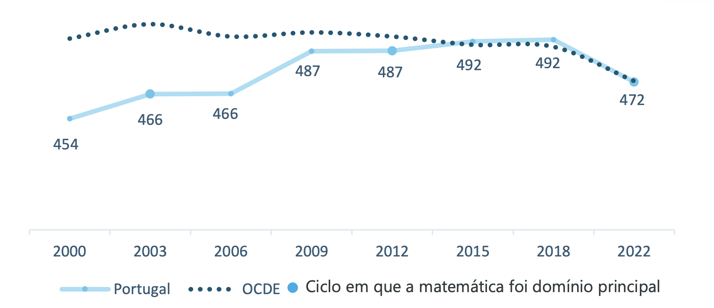

```{r setup, include=FALSE}
knitr::opts_chunk$set(echo = TRUE)
```

\newpage  

# Abstract

This report analyzes the determinants of academic performance using the UCI "Student Performance Data Set",  [@cortez2008student] derived from Mathematics classes in two Portuguese schools (Gabriel Pereira and Mousinho da Silveira) and collected through school reports and questionnaires. The study aims to identify the demographic, social, and behavioral factors driving final grades (G3), using empirical evidence to validate or refuse common assumptions about student performance. Employing Chi-Squared tests, along with parametric tests and regression analysis, we investigate variables ranging from family background to social habits.

\newpage

# Introduction

Education is a cornerstone of personal and economic development; however, high failure rates in core subjects such as Mathematics remain a significant challenge, particularly within the Portuguese secondary school system. Academic performance is rarely the result of a single variable. Instead, it emerges from a complex interplay of demographic attributes, family background, and individual social behaviors outside the classroom.

While previous studies on this dataset have primarily focused on minimizing predictive error using complex data mining algorithms, this report adopts a classical statistical framework. The primary objective is explanatory and inferential: to empirically isolate and quantify the factors that drive student success or failure.

The dataset, sourced from the UCI "Student Performance Data Set" [@cortez2008student], combines administrative records with questionnaire responses from secondary schools in Portugal, Gabriel Pereira and Mousinho da Silveira, collected during the 2005–2006 academic year. In particular, this report focuses on Mathematics subject.

To contextualize the dataset's timeframe, the latest PISA 2022 National Report by IAVE [@iave2023pisa], indicates that the student performance in Portugal has increased in the first decades of the 2000s. However, in recent years a downward trend has been observerd, although performance remains aligned with the OECD (Organisation for Economic Co-operation and Development) average.



We investigate whether common assumptions about student life hold statistical weight. The idea behind this analysis is to provide the statistical basis for answering some questions, like the following ones:
\begin{itemize}
  \item How do social habits (e.g., alcohol consumption, romantic relationships) interact with academic results?
  \item Do family background factors (e.g., parents' education) significantly stratify student performance?
  \item Can we quantify the impact of effort (study time) versus external support (paid classes) on the final Mathematics grade (G3)?
\end{itemize}

To address these questions, this study employs a structured statistical approach ranging from tests for independence and ANOVA for group comparisons, to Linear and Logistic Regression models for identifying significant predictors of the final grade.

\newpage

# Data description and exploration

```{r include=FALSE}
# stringsAsFactors = TRUE permitts to interpret strings as factors
# i.e. "yes" and "no" as factors and not as a string of characters
data <- read.csv("./data/student-mat.csv", sep=";", stringsAsFactors = TRUE)
str(data)
summary(data)
head(data)
```

The dataset was created based on school report cards relating to grades and number of absences, as well as questionnaires (with closed-ended questions), in order to supplement the previous information.
In total, there are 395 observations for the mathematics dataset and 33 variables with no missing values. We have both categorical and discrete variables. 

\begin{longtable}{p{2.5cm} p{11cm}}
\textbf{Attribute} & \textbf{Description (Domain)} \\
\hline
\textbf{school}     & school (binary: Gabriel Pereira [GP] or Mousinho da Silveira [MS]) \\
\textbf{sex}        & sex (binary: female [F] or male [M]) \\
\textbf{age}        & age (numeric: from 15 to 22) \\
\textbf{address}    & home address type (binary: urban [U] or rural [R]) \\
\textbf{famsize}    & family size (binary: $\le$ 3 or $>$ 3) \\
\textbf{Pstatus}    & parent's cohabitation status (binary: living together [T] or apart [A]) \\
\textbf{Medu}       & mother's education level (numeric: none [0] to higher [4]) \\
\textbf{Fedu}       & father's education level (numeric: none [0] to higher [4]) \\
\textbf{Mjob}       & mother's job (nominal: among 5 possible choices) \\
\textbf{Fjob}       & father's job (nominal: among 5 possible choices) \\
\textbf{reason}     & reason to choose this school (nominal) \\
\textbf{guardian}   & guardian (nominal: mother, father or other) \\
\textbf{traveltime} & home to school travel time (numeric: 1 to 4) \\
\textbf{studytime}  & weekly study time (numeric: 1 to 4) \\
\textbf{failures}   & number of past class failures (numeric: $n$ if $1 \le n < 3$, else 4) \\
\textbf{schoolsup}  & extra educational school support (binary: yes [Y] or no [N]) \\
\textbf{famsup}     & family educational support (binary: yes [Y] or no [N]) \\
\textbf{paid}       & extra paid classes (binary: yes [Y] or no [N]) \\
\textbf{activities} & extra-curricular activities (binary: yes [Y] or no [N]) \\
\textbf{nursery}    & attended nursery school (binary: yes [Y] or no [N]) \\
\textbf{internet}   & Internet access at home (binary: yes [Y] or no [N]) \\
\textbf{higher}     & wants to take higher education (binary: yes [Y] or no [N]) \\
\textbf{romantic}   & with a romantic relationship (binary: yes [Y] or no [N]) \\
\textbf{famrel}     & quality of family relationships (numeric: very bad [1] to excellent [5]) \\
\textbf{freetime}   & free time after school (numeric: very low [1] to very high [5]) \\
\textbf{goout}      & going out with friends (numeric: very low [1] to very high [5]) \\
\textbf{Dalc}       & workday alcohol consumption (numeric: very low [1] to very high [5]) \\
\textbf{Walc}       & weekend alcohol consumption (numeric: very low [1] to very high [5]) \\
\textbf{health}     & current health status (numeric: very bad [1] to very good [5]) \\
\textbf{absences}   & number of school absences (numeric: from 0 to 93) \\
\textbf{G1}         & first period grade (numeric: from 0 to 20) \\
\textbf{G2}         & second period grade (numeric: from 0 to 20) \\
\textbf{G3}         & final grade (numeric: from 0 to 20) \\
\end{longtable}

We use a comprehensive approach, displaying histograms for numerical data and bar plots for categorical data. The labels above the bars indicate the relative proportion of each category.

```{r echo=FALSE, fig.height=40, fig.width=25, echo=FALSE, message=FALSE, warning = FALSE}
library(ggplot2)
library(dplyr)
library(gridExtra)

plot_list <- list()

for (col_name in names(data)[1:(ncol(data)-3)]) {
  values <- data[[col_name]]
  if (is.numeric(values)) {
    p <- ggplot(data, aes(x = .data[[col_name]])) +
      geom_histogram(fill = "gray", color = "black", bins = 20) +
      theme_minimal(base_size = 24) +
      labs(title = col_name, y = "Freq", x = "")
  } else {
    p <- ggplot(data, aes(x = .data[[col_name]])) +
      geom_bar(aes(y = (after_stat(count))/sum(after_stat(count))), fill = "gray", color = "black") +
      geom_text(aes(y = (after_stat(count))/sum(after_stat(count)), 
                    label = round((after_stat(count))/sum(after_stat(count)), 2)), 
                stat = "count", vjust = -0.5) +
      scale_y_continuous(expand = expansion(mult = c(0, 0.15))) +
      theme_minimal(base_size = 24) +
      theme(axis.text.x = element_text(angle = 45, hjust = 1)) +
      labs(title = col_name, y = "Proportion", x = "")
  }
  plot_list[[col_name]] <- p
}
grid.arrange(grobs = plot_list, ncol = 4)
```

For the target variables (G1, G2, G3), we use box plots. This allows us to directly compare the distribution of votes over time. The graph below shows the median, the interquartile range and outliers (if are present).

```{r echo=FALSE, fig.height=5, fig.width=10}
library(tidyr)
cols_indices <- (ncol(data)-2):ncol(data)
cols_names <- names(data)[cols_indices]

data_long <- data %>%
  select(all_of(cols_names)) %>%
  pivot_longer(cols = everything(), names_to = "Variable", values_to = "Value")

ggplot(data_long, aes(x = Variable, y = Value)) +
  geom_boxplot(fill = "gray", color = "black") +
  theme_minimal(base_size = 24) +
  labs(y = "Grade", x = "")
```

# Statistical analysis

## Test of Independence

To analyze the relationship between categorical variables, we employ a two-step statistical approach based on the Chi-square ($\chi^2$) Test and Fisher's Exact Test.

The _Chi-square_ ($\chi^2$) test is used to assess whether a statistically significant association (dependency) exists between two categorical variables within a population by comparing the observed sample frequencies ($Observed$) against expected frequencies ($Expected$) calculated under the assumption of independence ($P(A) = P(A \mid B)$). 
The test assumes random sampling and that all expected values in every cell of the contingency table are at least 5 [@chisquare].

Our hypotheses are:
\begin{itemize}
  \item $H_0$: The variables are independent (no relationship)
  \item $H_1$: The variables are dependent (there is a relationship)
\end{itemize}

The $\chi^2$ statistics measure the divergence between observed data and the null hypothesis, and is computed as: $$\chi^2=\sum \frac{(Observed-Expected)^2}{Expected}$$

where the expected frequency for each cell is given by $$Expected = \frac{row\;total \; \times \; column\;total}{n}$$ and the degrees of freedom are calculated as: $$df=(number\;of\;rows-1)(number\;of\;columns-1)$$

When the Chi-square assumption is violated (expected frequencies $< 5$), the approximation becomes unreliable. In such cases, we prefer Fischer's Exact Test. This test calculates the exact probability of the data and directly provides the Odds Ratio, allowing us to quantify the strength and direction of the association.

### Family and Residence Influence

We investigated whether parental education (`Medu`, `Fedu`) or residence type (`address`) influences the intention to pursue higher education (`higher`). Given some low expected frequencies, we supported Chi-square tests with Fisher's Exact Tests.

```{r include=FALSE}
# Mother Variables
table_mother <- table(data$Medu, data$higher)
data$Medu_Level <- factor(ifelse(data$Medu <= 2, "Low", "High"), levels = c("Low", "High"))
test_fisher_m <- fisher.test(table(data$Medu_Level, data$higher))

# Father Variables
table_father <- table(data$Fedu, data$higher)
data$Fedu_Level <- factor(ifelse(data$Fedu <= 2, "Low", "High"), levels = c("Low", "High"))
test_fisher_f <- fisher.test(table(data$Fedu_Level, data$higher))

# Residence
table_address <- table(data$address, data$higher)
test_fisher_a <- fisher.test(table_address)
```

Fisher's Exact Test confirms a strong relationship for parents: students with highly educated mothers have odds of continuing studies `r round(test_fisher_m$estimate, 1)` times greater ($p=$ `r round(test_fisher_m$p.value, 3)`), with similar results for fathers (OR = `r round(test_fisher_f$estimate, 1)`, $p=$ `r round(test_fisher_f$p.value, 3)`). In contrast, residence type (Urban vs. Rural) shows no significant effect ($p=$ `r round(test_fisher_a$p.value, 3)`). 

## Test of Correlation

Correlation analysis quantifies the strength and direction of relationships between numerical variables, serving as the numerical equivalent to categorical tests like Chi-Squared. The choice of metric depends on data distribution: the standard Pearson coefficient ($r$) is used for normally distributed data, while the non-parametric Spearman coefficient ($r_S$) is preferred when the normality assumption is not met.

The value of the coefficient is inside the range $[-1,+1]$:
\begin{itemize}
    \item $r, r_S = 1$: perfect positive correlation
    \item $r, r_S = - 1$: perfect negative correlation
    \item $r, r_S = 0$: no correlation.
\end{itemize}

The test verifies the following hypotheses:
\begin{itemize}
    \item $H_0$: variables are not correlated ($r, r_S = 0$)
    \item $H_1$: there is a correlation between variables ($r, r_S \neq 0$).
\end{itemize}

### Impact of Absences on Final Grade

We hypothesize a negative relationship between the number of school absences (`absences`) and the final grade (`G3`). A high number of absences could affect the ability to keep up with the study program and lower performance.

To choose the most appropriate correlation test, we have to verify the distribution of the `absences` variable. In fact, the Pearson Correlation test assumes that data are drawn from a normal distribution.

```{r echo=FALSE}
hist(data$absences, main="Distribution of Absences", xlab="Number of Absences")
shapiro_test <- shapiro.test(data$absences)
```

As shown in the histogram, the variable follows a right-skewed distribution (strongly asymmetric). 

Then, the Shapiro-Wilk's test returns a p-value = `r shapiro_test$p.value` lower than $\alpha = 0.05$ that confirms non-normality. 
Given this information, it is better to compute a Spearman test, which does not require a normal distribution of the data.

```{r include=FALSE}
cor_spearman_absences <- cor.test(data$absences, data$G3, method = "spearman", exact = FALSE)
```

After computing the test, we can see that the correlation factor from Spearman is `r round(cor_spearman_absences$estimate, 3)`.

Due to the presence of ties in the `absences` and `G3` variables, the exact p-value for Spearman's $r_S$ could not be computed. Therefore, the standard asymptotic approximation was used `r round(cor_spearman_absences$p.value, 3)`. Since this value is very high, we cannot reject $H_0$. Statistically, this indicates no significant correlation between absences and the final grade in this dataset. This finding refutes our initial hypothesis that higher absences lead to lower grades.

Using a scatterplot, we can visualize the trend analyzed by the correlation test.

```{r echo=FALSE}
plot(data$absences, data$G3, 
     main = "Absences vs Final Grade (G3)",
     xlab = "Number of Absences", 
     ylab = "Final Grade (G3)", 
     pch = 19, col = rgb(0,0,1,0.5))
abline(lm(data$G3 ~ data$absences), col = "red")
```

## T-Test (Group Comparison)

The Student's t-test is a parametric statistical method used to determine if there is a significant difference between the means of two independent groups. It assumes that the data follows a normal distribution and that the observations are independent.

We test the following hypotheses:

*   $H_0: \mu_1 = \mu_2$ (There is no difference in mean grades between the groups)
*   $H_1: \mu_1 \neq \mu_2$ (There is a significant difference in mean grades)

The test statistic $t$ is calculated based on the difference in sample means relative to the standard error of the difference. If the resulting p-value is less than our significance level ($\alpha = 0.05$), we reject the null hypothesis.

### Hypothesis A (Technological)

Is there a significant difference in grades between those who have Internet at home and those who do not?

```{r, echo=FALSE, include=FALSE}
t.test(G3 ~ internet, data = data)
```

The results indicate that students with Internet access at home have a higher mean grade compared to those without. The T-test yields a p-value of `r round(t.test(G3 ~ internet, data = data)$p.value, 5)` slightly below the 0.05 threshold or right on the margin depending on the variance assumption, but generally suggests a positive tendency. Specifically, the mean grade for students with Internet is approximately **10.6**, while for those without, it is **9.4**. 

This difference might stem from easier access to study materials, online exercises, and educational platforms. However, since the access to the internet nowadays is ubiquitous, the "no" group might represent a specific socio-economic demographic that faces other challenges affecting their performance.

### Hypothesis B (Sentimental)

Do students in a romantic relationship have lower grades compared to single students?

```{r, echo=FALSE, include=FALSE}
t.test(G3 ~ romantic, data = data)
```

Here we observe a statistically significant difference. The mean grade for single students is approximately **10.8**, whereas students in a romantic relationship have a mean grade of **9.6**. $p \approx `r round(t.test(G3 ~ romantic, data = data)$p.value, 3)`$ confirms that this difference is unlikely to be due to chance.

This finding aligns with the "time allocation" theory: maintaining a romantic relationship requires time and emotional energy that might otherwise be dedicated to studying. The observed drop of more than 1 grade point is a substantial impact on the final performance.

## ANOVA (Group Comparison: Multiple Groups)

Analysis of Variance (ANOVA) was used to test differences between means of more than two groups ($H_0: \mu_1 = \dots = \mu_k$).

```{r, echo=FALSE, include=FALSE}
# Models for inline reporting
aov_mjob <- summary(aov(G3 ~ Mjob, data = data))[[1]]
aov_walc <- summary(aov(G3 ~ as.factor(Walc), data = data))[[1]]
aov_travel <- summary(aov(G3 ~ traveltime, data = data))[[1]]
```

**Mother's Occupation:** We found significant differences in mean grades (F = `r round(aov_mjob["Mjob", "F value"], 2)`, p < 0.05). Children of health professionals (mean G3=12.15) and teachers perform significantly better than those whose mothers work at home (mean G3=9.15). This reflects potential socio-economic advantages.

**Alcohol Consumption:** Surprisingly, weekend alcohol consumption (`Walc`) showed **no significant difference** in grades (F = `r round(aov_walc["as.factor(Walc)", "F value"], 2)`, p > 0.05). While heavy drinkers show a slight dip, the variance is not statistically distinct, suggesting that moderate social habits may not be the primary driver of failure when isolated.

**Travel Time:** There is a marginally significant effect of travel time (p $\approx$ `r round(aov_travel["traveltime", "Pr(>F)"], 3)`), with a clear downward trend. Students with <15 min travel time average 10.8, while those with >3 hours average 8.75. Long commutes likely reduce available study time and increase fatigue.

## Logistic Regression

Logistic Regression is the standard statistical method for binary classification problems.
It models the probability $\vartheta(X)=P(Y=1|X)$ that an event occurs as a function of independent variables $X$. Instead of fitting a straight line, it uses the logistic function to map the output between 0 and 1.

The logistic function is defined as:
$$\vartheta(X) = \frac{e^{\beta_0 + \beta_1 X_1 + \dots + \beta_k X_k}}{1 + e^{\beta_0 + \beta_1 X_1 + \dots + \beta_k X_k}}$$
and the regression is expressed in terms of log-odds: $$\log\left(\frac{\vartheta(X)}{1-\vartheta(X)}\right) = \beta_0 + \beta_1 X_1 + \dots + \beta_k X_k$$
Where $\beta_i$ are the coefficients of the model.

A positive coefficient ($\beta_i > 0$) implies that as $X_i$ increases, the odds/probability of success increase. Conversely, a negative coefficient suggests a decrease in the probability of success.

### Educational Support Analysis

We aimed to predict potential for promotion (`G3` $\ge$ 10). Initial predictors selected were `schoolsup`, `paid`, and `higher`. A preliminary check confirmed low multicollinearity between these binary variables (max correlation $r \approx 0.18$), allowing safe inclusion in the model.

### Model Comparison

We developed three models to predict student promotion:

1.  **Initial Model:** Academic support variables only (`schoolsup`, `paid`, `higher`).
2.  **Improved Model:** Added `failures` and `goout` to capture background logic.
3.  **Stepwise Model:** Automated selection on all variables to validate the manual choice.

```{r include=FALSE}
data$Promoted <- ifelse(data$G3 >= 10, 1, 0)
logit_model <- glm(Promoted ~ schoolsup + paid + higher, data = data, family = binomial)
logit_improved <- glm(Promoted ~ schoolsup + paid + higher + failures + goout, data = data, family = binomial)

logit_full <- glm(Promoted ~ schoolsup + paid + higher + failures + goout + 
                            absences + studytime + activities + nursery + internet + 
                            address + Pstatus + famrel + freetime + health + sex + Dalc + Walc, 
                            data = data, family = binomial)
logit_stepwise <- step(logit_full, direction = "both", trace = 0)
```

The **Initial Model** showed `higher` as a positive predictor, but the **Improved Model** significantly lowered the AIC (from `r round(logit_model$aic,0)` to `r round(logit_improved$aic, 0)`), highlighting the critical negative impact of past `failures`. The **Stepwise** algorithm converged to the same set of predictors as our Improved Model (plus `sex`), confirming the robustness of our manual selection.

### Excluding Zero-Grades

We observed 38 "dropout" entries (`G3`=0). We re-tested the Improved Model on filtered data to ensure results weren't driven solely by these outliers.

```{r include=FALSE}
data_filtered <- subset(data, G3 != 0)
data_filtered$Promoted <- ifelse(data_filtered$G3 >= 10, 1, 0)
logit_filtered <- glm(Promoted ~ schoolsup + failures + goout + paid + higher, 
                      data = data_filtered, family = binomial)
```

### ROC Evaluation

We compared the discriminative ability of the models.

```{r include=FALSE}
library(pROC)

prob_model <- predict(logit_model, type = "response")
prob_improved <- predict(logit_improved, type = "response")
prob_stepwise <- predict(logit_stepwise, type = "response")
prob_filtered <- predict(logit_filtered, type = "response")

roc_model <- roc(data$Promoted, prob_model)
roc_improved <- roc(data$Promoted, prob_improved)
roc_stepwise <- roc(data$Promoted, prob_stepwise)
roc_filtered <- roc(data_filtered$Promoted, prob_filtered)
```
```{r message=FALSE, echo=FALSE, fig.height=4, fig.width=6, fig.align='center'}
# Plot ROC curves tightly
par(mar=c(4,4,1,1))
plot(roc_model, col="red", main="ROC Analysis", lwd=2, legacy.axes=TRUE)
plot(roc_improved, col="blue", add=TRUE, lwd=2)
plot(roc_stepwise, col="green", add=TRUE, lwd=2)
plot(roc_filtered, col="magenta", add=TRUE, lwd=2)
legend("bottomright", 
       legend=c(paste("Initial (AUC=", round(auc(roc_model), 2), ")"), 
       paste("Improved (AUC=", round(auc(roc_improved), 2), ")"),
       paste("Stepwise (AUC=", round(auc(roc_stepwise), 2), ")"),
       paste("Filtered (AUC=", round(auc(roc_filtered), 2), ")")),
       col=c("red", "blue", "green", "magenta"), lwd=2, cex=0.8)

data["Promoted"] <- NULL  # Clean up
data_filtered["Promoted"] <- NULL  # Clean up
```

The Improved Model (Blue) clearly outperforms the Initial Model. Importantly, the Filtered Model (Magenta) maintains high accuracy (AUC $\approx$ `r round(auc(roc_filtered), 2)`), proving the model effectively distinguishes passing students from failing ones, not just dropouts.

## Linear Regression (Numerical Prediction)

Linear Regression is a statistical method used to model the relationship between a dependent variable $Y$ and one or more independent variables $X$. The goal is to find the linear equation that best predicts the value of the dependent variable based on the predictors.

The general formula is:
$$ Y = \beta_0 + \beta_1 X_1 + \beta_2 X_2 + \dots + \beta_k X_k + \epsilon $$
Where:

  -   $\beta_0$ is the intercept.
  -   $\beta_i$ are the coefficients representing the change in $Y$ for a one-unit change in $X_i$.
  -   $\epsilon$ is the error term (residuals).

We aim to predict the final grade (**G3**) based on different sets of predictors.

### Numeric Prediction Models

We built Linear Regression models to predict the final grade `G3`. A preliminary correlation check highlighted strong collinearity between parental education levels (`Medu`, `Fedu`, $r \approx 0.62$) and alcohol consumption types (`Dalc`, `Walc`, $r \approx 0.65$), guiding our variable selection.

We tested two hypothesis-based models and one automated model:

1.  **Academic Effort Model:** Predictors `studytime`, `absences`, `failures`. ($R^2 \approx 13.5\%$)
2.  **Background Model:** Predictors `Medu`, `famrel`, `internet`. ($R^2 \approx 5.3\%$)
3.  **Optimized Model (Stepwise):** Selected via AIC.

```{r, echo=FALSE, include=FALSE}
# Model A
model_a <- lm(G3 ~ studytime + absences + failures, data = data)
# Model B
model_b <- lm(G3 ~ Medu + famrel + internet, data = data)
# Full Optimization
full_model <- lm(G3 ~ . - G1 - G2, data = data)
best_model <- step(full_model, direction = "both", trace = 0)
```

The **Optimized Model** included `failures`, `Medu`, `goout`, `absences`, and `famrel` as significant predictors ($p < 0.05$). Academic history (`failures`) remained the strongest driver ($\beta \approx -2.0$), but family influence (`Medu`) was also validated.

### Diagnostics and Refinement

Diagnostic plots for the Optimized Model revealed non-normality in the residuals, driven largely by the subset of students with `G3=0` (dropouts). To fix this, we refined the model to predict performance only for active students (`G3 > 0`).

```{r fig.align="center", echo=FALSE, message=FALSE, warning=FALSE}
library(ggplot2)
library(gridExtra)

# --- Full Model Diagnostics (Best Model) ---
residuals_df <- data.frame(residuals = rstandard(best_model))

p1 <- ggplot(residuals_df, aes(sample = residuals)) +
  geom_qq(color = "steelblue", alpha = 0.6) +
  geom_qq_line(color = "red", linetype = "dashed", linewidth = 1) +
  labs(title = "Normal Q-Q (Full Data)",
       subtitle = "Significant deviation (Left Tail)",
       x = "Theoretical Quantiles", y = "Standardized Residuals") +
  theme_minimal()


predictions <- predict(best_model)
results <- data.frame(Actual = data$G3, Predicted = predictions)

p2 <- ggplot(results, aes(x = Actual, y = Predicted)) +
  geom_jitter(color = "steelblue", alpha = 0.6, width = 0.2, height = 0.2) +
  geom_abline(intercept = 0, slope = 1, color = "darkred", linetype = "dashed", linewidth = 1) +
  labs(title = "Actual vs Predicted (Full Data)",
       subtitle = "Model struggles with 0-grade cluster",
       x = "Actual Grade", y = "Predicted Grade") +
  coord_fixed(ratio = 1, xlim = c(0, 20), ylim = c(0, 20)) +
  theme_minimal()

# --- Refined Model (G3 > 0) ---
data_nonzero <- subset(data, G3 > 0)
refined_model <- update(best_model, data = data_nonzero)

residuals_refined <- data.frame(residuals = rstandard(refined_model))

p3 <- ggplot(residuals_refined, aes(sample = residuals)) +
  geom_qq(color = "forestgreen", alpha = 0.6) +
  geom_qq_line(color = "red", linetype = "dashed", linewidth = 1) +
  labs(title = "Normal Q-Q Plot (Refined)",
       subtitle = "Normality assumption satisfied",
       x = "Theoretical Quantiles", y = "Standardized Residuals") +
  theme_minimal()

pred_refined <- predict(refined_model)
results_refined <- data.frame(Actual = data_nonzero$G3, Predicted = pred_refined)

p4 <- ggplot(results_refined, aes(x = Actual, y = Predicted)) +
  geom_jitter(color = "forestgreen", alpha = 0.6, width = 0.2, height = 0.2) +
  geom_abline(intercept = 0, slope = 1, color = "darkred", linetype = "dashed", linewidth = 1) +
  labs(title = "Actual vs Predicted (Refined)",
       subtitle = "Prediction closer to ideal line",
       x = "Actual Grade (G3 > 0)", y = "Predicted Grade") +
  coord_fixed(ratio = 1, xlim = c(0, 20), ylim = c(0, 20)) +
  theme_minimal()

grid.arrange(p1, p3, p2, p4, ncol = 2)
```

By removing the noise from dropouts, the refined model shows substantial improvements:

1.  **Validity**: The refined model's $R^2$ increased to **0.275** (from ~0.15), and the Q-Q plot (top right) confirms normality is satisfied.
2.  **The "Absences" Flip**: In the refined model, the coefficient for absences flips to **negative ($\approx -0.055$)**, proving that for active students, missing class hurts performance.
3.  **Selection Bias in School Support**: The negative effect of school support suggests it acts as a proxy for at-risk students.

```{r, echo=FALSE}
# Extract coefficients for table display
coefs_table <- summary(refined_model)$coefficients
significant_preds <- coefs_table[coefs_table[, "Pr(>|t|)"] < 0.05 & rownames(coefs_table) != "(Intercept)", ]

knitr::kable(significant_preds[, c("Estimate", "Pr(>|t|)")], 
             digits = 4, 
             caption = "Significant Predictors (Refined Model)")
```

# Conclusions and Discussion

This study aimed to deconstruct the factors influencing academic performance in Mathematics using a rigorous statistical framework. By moving from exploratory independence tests to refined linear regression models, we have uncovered several key insights that challenge common assumptions and highlight the structural nature of student success.

## The Inertia of Academic History vs. Current Effort
One of the most striking findings is the dominance of **past failures** over **current study time**.  
While the "Effort" model hypothesized that weekly study hours would be a primary driver of grades, our regression analysis showed that `studytime` was not statistically significant when controlling for past performance. In contrast, every past failure reduced the expected final grade by over 2 points.
This suggests a strong **"inertia"** in academic performance: gaps in knowledge accumulated in previous years create a deficit that is difficult to bridge solely through short-term increases in weekly study intensity. Success is cumulative, and early intervention to prevent the *first* failure is likely more effective than remedial study hours later on.

## The "Paradox" of Educational Support
Our refined model revealed a strong negative correlation between **School Educational Support** (`schoolsup`) and final grades ($\beta \approx -2.09$). 
This result should be interpreted with caution. It is a classic example of **selection bias** rather than causality. The educational support is not *causing* poor performance; rather, it is effectively targeting those students who are already struggling. Statistically, `schoolsup` acts as a proxy for "risk status," identifying students with foundational gaps that even the support measures cannot fully close within the observed timeframe.

## The Social Trade-off: Romance vs. Alcohol
The analysis of social behaviors offered a nuanced perspective on student life.

*   **Romantic Relationships**: We observed a significant penalty for students in relationships (>1 grade point drop). This supports the "resource allocation" theory, where the time and emotional energy demanded by relationships compete directly with academic focus.
*   **Alcohol Consumption**: contrary to the "moral panic" often associated with youth alcohol use, weekend consumption (`Walc`) did not show a statistically significant independent negative effect on grades in our ANOVA or regression models. This implies that moderate social engagement does not inherently harm performance, whereas the sustained daily time commitment of a relationship does.

## Socio-Economic Stratification
The "Nature/Nurture" hypothesis was partially confirmed. **Mother's Education** (`Medu`) emerged as a pervasive influence, affecting not just the intention to pursue higher education (as shown in the Chi-Square tests) but also the final mathematics grade (in the stepwise regression). This confirms that the "socio-economic elevator" is still heavily dependent on the "starting floor" provided by the family environment.

## Methodological Takeaway: The "Two-Population" Reality
Finally, our diagnostic analysis uncovered a critical methodological insight for this dataset: the distinction between **Academic Failure** (low grades) and **Administrative Failure** (grade 0). 
Including 0-grades in a continuous linear model introduces severe noise, masking the true marginal effects of variables like **absences**. By separating the data, we proved that for active students, absences *do* carry a negative cost. Future predictive modeling on this dataset should treat dropout prediction (Logistic Regression for G3=0) and grade prediction (Linear Regression for G3>0) as two distinct tasks.

